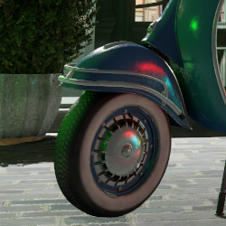
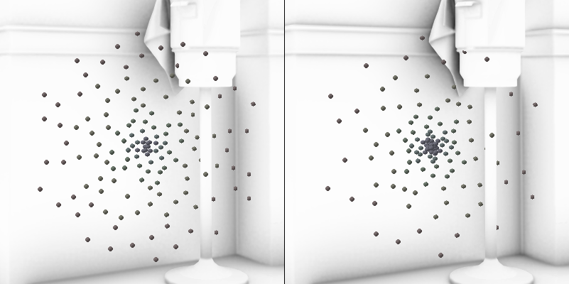
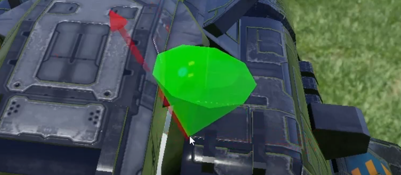

# DISCONTINUATION OF PROJECT #  
This project will no longer be maintained by Intel.  
Intel has ceased development and contributions including, but not limited to, maintenance, bug fixes, new releases, or updates, to this project.  
Intel no longer accepts patches to this project.  
 If you have an ongoing need to use this project, are interested in independently developing it, or would like to maintain patches for the open source software community, please create your own fork of this project.  
  
# XeGTAO

## Introduction

XeGTAO is an open source, MIT licensed, DirectX/HLSL implementation of the  _Practical Realtime Strategies for Accurate Indirect Occlusion, GTAO_ [\[Jimenez et al., 2016\]](https://www.activision.com/cdn/research/Practical_Real_Time_Strategies_for_Accurate_Indirect_Occlusion_NEW%20VERSION_COLOR.pdf), a screen space effect suitable for use on a wide range of modern PC integrated and discrete GPUs. The main benefit of GTAO over other screen space algorithms is that it uses a radiometrically-correct ambient occlusion equation, providing more physically correct AO term.

We have implemented and tested the core algorithm that computes and spatially filters the ambient occlusion integral and, optionally, directional GTAO component (bent normals / cones).

Our implementation relies on an integrated spatial denoising filter and will leverage TAA for temporal accumulation when available. When used in conjunction with TAA it is both faster, provides higher detail effect on fine geometry features and is more radiometrically correct than other common public SSAO implementations such as closed source [\[HBAO+\]](https://www.nvidia.com/en-gb/geforce/technologies/hbao-plus/technology/), and open source [\[ASSAO\]](https://software.intel.com/content/www/us/en/develop/articles/adaptive-screen-space-ambient-occlusion.html).

High quality preset, computed at full resolution, costs roughly 1.4ms at 3840x2160 on RTX 3070, 0.56ms at 1920x1080 on RTX 2060 and 2.39ms at 1920x1080 on 11th Gen Intel(R) Core(TM) i7-1195G7 integrated graphics. Faster but lower quality preset is also available. Computing and filtering the directional component (bent normals) adds roughly 25% to the cost.

This sample project ([Vanilla.sln](VisualStudio/Vanilla.sln)) was tested with Visual Studio 2019 16.10.3, DirectX 12 GPU (Shader Model 6_3), Windows version 10.0.19041. 


XeGTAO OFF/ON/ON+BentNormals comparison in Amazon Lumberyard Bistro; click on image to embiggen:  
[](Images/new-exterior-0-off.png) [](Images/new-exterior-1-GTAO.png) 
[](Images/new-exterior-2-GTAO+BentNormals.png)

AO term only, left: ASSAO Medium (~0.72ms), right: XeGTAO High (~0.56ms), as measured on RTX 2060 at 1920x1080:
  


## Implementation and integration overview

We focus on simplicity and ease of integration with all relevant code provided in a 2-file, header only-like format:
 * [**XeGTAO.h**](/Source/Rendering/Shaders/XeGTAO.h) provides the glue between the user codebase and the effect; this is where macro definitions, settings, constant buffer updates and optional ImGui debug settings are handled.
 * [**XeGTAO.hlsli**](/Source/Rendering/Shaders/XeGTAO.hlsli) provides the core shader code for the effect.

These two files contain the minimum required to integrate the effect, with the amount of work depending on the specific platform and engine details. In an ideal case, the user codebase can include these two files above with little or no modifications, and provide additional resources including working textures, a constant buffer, compute shaders, as well as codebase-specific shader code used to load screen space normals and etc, as shown in the usage example (see [vaGTAO.h](/Source/Rendering/Effects/vaGTAO.h), [vaGTAO.cpp](/Source/Rendering/Effects/vaGTAO.cpp), [vaGTAO.hlsl](/Source/Rendering/Shaders/vaGTAO.hlsl)).
https://github.com/GameTechDev/XeGTAO/blob/master/Source/Rendering/Shaders/vaGTAO.hlsl

The effect is usually computed just after the depth data becomes available (after the depth pre-pass or a g-buffer draw). It takes depth buffer and (optional) screen space normals as inputs, produces a single channel AO buffer as the output and consists of three separate compute shader passes:
 * [**PrefilterDepths pass**](https://github.com/GameTechDev/XeGTAO/blob/e7698f874e90f2516fca26c696ec3cd2c70e505a/Source/Rendering/Shaders/XeGTAO.hlsli#L617): inputs depth buffer; performs input depth conversion to viewspace and generation of depth MIP chain; outputs intermediary viewspace depth buffer with a MIP chain
 * [**MainPass**](https://github.com/GameTechDev/XeGTAO/blob/e7698f874e90f2516fca26c696ec3cd2c70e505a/Source/Rendering/Shaders/XeGTAO.hlsli#L245): inputs intermediary depth buffer and (optional) screen space normals; performs the core GTAO algorithm; outputs unfiltered AO term and intermediary edge information by the denoiser
 * [**Denoise**](https://github.com/GameTechDev/XeGTAO/blob/e7698f874e90f2516fca26c696ec3cd2c70e505a/Source/Rendering/Shaders/XeGTAO.hlsli#L734): inputs unfiltered AO term and intermediary edge information; performs the spatial denoise filter; outputs the final AO term


## Implementation details
 
Following is a list of implementation details and differences from the original GTAO paper [\[Jimenez et al., 2016\]](https://www.activision.com/cdn/research/Practical_Real_Time_Strategies_for_Accurate_Indirect_Occlusion_NEW%20VERSION_COLOR.pdf):

### Automatic heuristic tuning based on ray-traced reference

In order to best reproduce the work from the original paper and tune the heuristics, we built a simple ray tracer within the development codebase that can render AO ground truth. The ray tracer uses cosine-weighted hemisphere Monte Carlo sampling to approximate Lambertian reflectance for a hemisphere defined by a given point and geometry normal, using near-field bounding long visibility rays.

  
_left: Reference diffuse-only raytracer, 512spp; right: XeGTAO High preset_

Using the ray-traced output as a ground truth, we then tune the XeGTAO heuristics for a best match across several scenes and locations and different near-field bound radii settings. We rely in big part on an automatic system informally called auto-tune, where selected settings (such as thickness heuristic, radius multiplier, falloff range, etc.) can be automatically tuned together. Given min/max ranges for each setting, the auto-tune will run through all permutations across pre-defined scene locations, searching for the lowest overall average MSE between the XeGTAO and raytraced ground outputs. For practical reasons we employ a multi-pass search based on narrowing the setting ranges.

### Denoising
Original GTAO implementation is described as using spatio-temporal sampling with temporal reprojection; our current approach uses only a 5x5 depth-aware spatial denoising filter and relies on TAA for the temporal component, when available. This is a compromise that allows for the effect to still be used by codebases that do not employ TAA. When TAA is available, we indirectly leverage it by enabling temporal noise. The downside is that we must keep temporal variance low enough to avoid having TAA mischaracterizing this noise as features, which limits the amount of temporal supersampling that we can leverage. Depending on user feedback and future experimentation we are likely to go with the combined spatio-temporal approach in the future.

  
_left: raw 3 slices 6 samples per pixel (18spp) XeGTAO output; middle: +5x5 spatial denoiser; right: +TAA and temporal noise_

### Resolution and sampling

Original GTAO implementation runs at half-resolution with one slice per pixel, 12 samples per hemisphere slice (6 per side; the _hemisphere slice_ term is defined in the original paper). We default to running at full resolution, 3 slices per pixel with 6 samples (3 per side) each for a total of 18spp, and also have a lower quality preset with 2 slices per pixel and 4 samples (2 per side) for a total of 8spp. The reasoning behind reduction in samples per slice is described in 'Thickness Heuristic' section. This balance is likely to change if we move to a combined spatio-temporal approach in the future.

### Sample distribution
In order to better capture thin crevices and similar small features, we use x = pow( x, 2 ) distribution for samples along the slice direction, where x is a normalized screen space distance from the evaluated pixel's center to the maximum distance (representing the worldspace 'Effect radius'). This is another setting where we used auto-tune to find the most optimal value, which was around 2.1. We decided to round it down to 2 for simplicity and performance reasons. 

  
_different sample power distribution settings; left: setting of 1.0; right: setting of 2.0, clumping more samples around the center gives more detail to small feature shadows_


### Near-field bounding
Like the [\[Jimenez et al., 2016\]](https://www.activision.com/cdn/research/Practical_Real_Time_Strategies_for_Accurate_Indirect_Occlusion_NEW%20VERSION_COLOR.pdf), we attenuate the effect from distant samples based on near-field occlusion radius setting ('Effect radius') over a a range ('Falloff range'). This provides stable and predictable results and is easier to use in conjunction with longer-range, lower-frequency GI. Unlike the original, we do not linearly interpolate the sample horizon angle cosine towards -1 but towards the hemisphere horizon, computed as cos(normal_angle+PI/2) in one direction and cos(normal_angle-PI/2) in the other.

  
_out of bounds sample interpolation, left: towards -1; middle: ray traced ground truth; right: ours, towards sample horizon, resulting in less detail loss, noticeable around the window and curtain areas_

This makes the attenuation function independent from the projected normal vector, avoid haloing or loss of detail under certain view angles, providing results that are on average closer to the ground truth.

### Thin occluder conundrum
The main difficulty of approximating AO from the depth buffer is that the depth buffer is effectively a viewspace heightmap and does not correctly represent the actual scene geometry. This leads to visual artifacts such as thin features at depth discontinuities casting too much occlusion (please see 'Height-field assumption considerations' from the [\[Jimenez et al., 2016\]](https://www.activision.com/cdn/research/Practical_Real_Time_Strategies_for_Accurate_Indirect_Occlusion_NEW%20VERSION_COLOR.pdf)) or haloing effects. The larger the near-field bounding radius setting, the worse the mismatch usually is. Conversely, with a radius that is small in proportion to geometry features, and using various heuristics to minimize the side-effects, a reasonably good approximation can be achieved. There are other solutions to improving the quality of the source geometry representation (such as Multi-view AO, [\[Vardis et al. 2013\]](https://dl.acm.org/doi/10.1145/2448196.2448214), or the more recent Stochastic-Depth Ambient Occlusion [\[Vermeer et al, 2021\]](https://dl.acm.org/doi/10.1145/3451268) ) which we did not consider due to complexity as they require changes to the rendering pipeline, but which could certainly be adopted for use with XeGTAO.

The original paper describes a conservative _thickness heuristic_ that is derived from the assumption that the thickness of an object is similar to its size in screen space; the end result of it is that "a single sample that is behind the horizon will not significantly decrease the computed horizon, but many of them (in e.g. a thin feature) will considerably attenuate it". In our experimentation we found that increasing the number of slices while undersampling the horizon search (using lower number of samples per slice) achieves very similar result with the same overall number of samples. This removes the need for the somewhat computationally expensive heuristic.

We also experimented with a different heuristic that biases the near-field bounding falloff along the view vector, and in effect reducing the impact of samples that are in front of the evaluated pixel's depth (closer to the camera plane). This provided results closer to the ground truth compared to the heuristic from the original paper and this is now exposed through the "Thin occluder compensation" setting. With 6 (3+3) samples per slice, the (auto-tuned) optimum setting value yields a relatively small improvement, so we disabled it by default for performance reasons. It can be easily enabled if higher quality is required.

  
_left: default 'Thin occluder compensation' of 0; middle: ray traced ground truth; right: 'Thin occluder compensation' of 0.7_

Above image demonstrates two opposing scenarios: in the top row, even the default settings (left column) over-compensate the thin occluder issue due to shelves being very deep, and increasing _thin occluder compensation_ setting (right column) serves only to further deviate from the ground truth (middle column). This is in contrast to the bottom row where pipe and chair legs are very thin, and a high _occluder compensation_ setting (right column) matches ground truth more closely.

### Sampling noise

As with any technique based on Monte Carlo integration, a [a good sampling method can significantly reduce the number of samples needed for the same quality](https://pbr-book.org/3ed-2018/Monte_Carlo_Integration/Careful_Sample_Placement). The original GTAO paper describes a tileable spatial noise of 4x4 with 6 different temporal rotations.

For stratified sampling we map screen coordinates to a Hilbert curve index, using it to drive Martin Robert's [R2 quasi-random sequence](http://extremelearning.com.au/unreasonable-effectiveness-of-quasirandom-sequences/). This was inspired by an [excellent shadertoy example by user 'paniq'](https://www.shadertoy.com/view/3tB3z3) with the only difference in our code being that we use a R2 sequence instead of R1 since we need two low-discrepancy samples for chosing slice angle and step offset. We use a 6 level Hilbert curve, providing a 64x64 repeating tile, and for the temporal component we add an offset of ```288*(frameIndex%64)```, found empirically.

Before we settled on the Hilbert curve + R2 sequence, we used a 2 channel 64x64 tileable blue noise from [Christoph Peters's blog](http://momentsingraphics.de/BlueNoise.html) to drive slice rotations and individual sample noise offsets. This worked well for spatial-only noise but adding temporal offsets/rotations caused overlaps which would often show as temporal artifacts. We then switched to a 3D noise (from [the sequel blogpost](https://momentsingraphics.de/3DBlueNoise.html) which worked well with TAA but was fairly big in size and did not work well when using spatial-only filtering (to quote the blog, "Good 3D noise is a bad 2D blue noise").

Since computing Hilbert curve index in the compute shader adds measurable cost (~7%), we optionally precompute it into a lookup texture which reduces this overhead. C++/HLSL code to compute the Hilbert Index is available in XeGTAO.h and the user can choose between the (simpler) GPU arithmetic or (usually faster) LUT-based codepaths.

  
_5x5 spatial with 8 frame temporal filter, left: using hash-based pseudo-random noise; right: using Hilbert curve index driving R2 sequence_

### Memory bandwidth bottleneck
Most screen space effects are performance-limited by the available memory bandwidth and texture caching efficiency, and XeGTAO is no different. 

One common approach, which we rely on, relies on a technique presented in *Scalable Ambient Obscurance* [\[McGuire et al, 2012\]](https://research.nvidia.com/sites/default/files/pubs/2012-06_Scalable-Ambient-Obscurance/McGuire12SAO.pdf) and involves pre-filtering depth buffer into MIP hierarchy, allowing the more distant (from the evaluated pixel's center) locations to be sampled using lower detail MIP level. We follow the same approach as in the paper, with the exception of the choice of the depth MIP filter, for which we use a weighted average of samples, with the weight determined by whether the depth difference from the most distant sample is within a predefined threshold (please refer to DepthMIPFilter in the code for details). Using the most distant sample introduces a natural thin occluder bias and is more stable under motion compared to rotated grid subsampling (from the SAO paper), while averaging provides least precision errors on most slopes.

  
_left: color-coded sample MIP levels; middle: example of detail loss with a too low 'Depth MIP sampling offset' of 2.0; right: depth MIP mapping disabled_

'Depth MIP sampling offset' user setting controls the MIP level selection (_mipLevel = max( 0, log2( sampleOffsetLength ) - DepthMIPSamplingOffset )_). The lower the value, the lower detailed MIPs are used, reducing memory bandwidth but also reducing quality. It defaults to the value of 3.15 which is the point below which there is no measurable performance increase on any of the tested hardware.

Another popular solution to this problem is presented in *Deinterleaved Texturing for Cache-Efficient Interleaved Sampling* [\[Bavoil, 2014\]](https://developer.nvidia.com/sites/default/files/akamai/gameworks/samples/DeinterleavedTexturing.pdf) and involves a divide and conquer technique where the working dataset is subdivided into smaller parts that are processed in sequence, ensuring a much better utilization of memory cache structures. The downside is that by the definition, the processing of one dataset part can only rely on sampling data from that part, which constrains the sampling pattern. This was a significant issue for GTAO with its specific sampling pattern (samples lie on a straight line, etc.) where constraining them to a subset of data significantly limited flexibility, consistency and amplified precision issues, so we could not use this approach in XeGTAO.

### Bent normals

Support for directional component (bent normals) was added in XeGTAO version 1.30, and is directly based on the formulation from the original [\[Jimenez et al., 2016\]](https://www.activision.com/cdn/research/Practical_Real_Time_Strategies_for_Accurate_Indirect_Occlusion_NEW%20VERSION_COLOR.pdf), page 15, 'Algorithm 2'. Since this feature increases overal effect computation time by roughly 25%, it is an optional feature. When enabled, bent normal vector is computed in the MainPass and denoised together with the occlusion term. The output is packed into first 3 channels of a R8G8B8A8 texture, with the occlusion term stored in the alpha channel.

[](https://www.youtube.com/watch?v=JHK2RMS6hhc)
_debug visualization of bent cone (green) and the shading normal (red); click for the video_

In the Bistro scene lighting we use the AO term to attenuate diffuse and specular irradiance from light probes using the multi-bounce diffuse and GTSO approaches detailed in the original GTAO work. We also attenuate unshadowed direct lighting using the micro-shadowing approximation from _Material Advances in Call of Duty: WWII_ [\[Chan 2018\]](https://www.activision.com/cdn/research/siggraph_2018_opt.pdf) and [SIGGRAPH 2016: Technical Art of Uncharted](http://advances.realtimerendering.com/other/2016/naughty_dog/index.html). It should be noted that the sample's current AO term usage is somewhat ad-hoc and has itself not been matched to ground truth, and is not meant as a reference.

[](Images/simplelights-0-off.png) [](Images/simplelights-1-GTAO.png) 
[](Images/simplelights-2-GTAO+BentNormals.png)  
_XeGTAO OFF/ON/ON+BentNormals: directional component significantly improves contact shadow correctness for lights that lack explicit shadowing; click to enlarge_

### Misc
 * We added a global 'Final power' heuristic that modifies the visibility with a power function. While this has no basis in physical light transfer, we found that auto-tune can use it to achieve better ground truth match in combination with all other settings.
 * In order to minimize bandwidth use we rely on 16-bit floating point buffer to store viewspace depth. This does cause some minor precision quality issues but yields better performance on most hardware. It is however not compatible with built-in screen space normal map generator.
 * It is always advisable to provide screen space normals to the effect, but in case that is not possible we provide a built-in depth to normal map generator.
 * We have enabled fp16 (half float) precision shader math on most places where the loss in precision was acceptable; this provides 5-20% performance boost on various hardware that we have tested on but is entirely optional.


  
_left: ASSAO Medium (~0.72ms*), right: XeGTAO High (~0.56ms*) (*as measured on RTX 2060 at 1920x1080)_  
 
### FAQ

 * **Q:** It is still too slow for our target platform, what are our options?
 * **A:** The "Medium" quality preset is roughly 2/3 of the cost of the "High" preset (for ex., 1.5ms vs 2.2ms at 1920x1080, GTX 1050), while the "Low" quality preset is roughly 2/3 of the cost of the "Medium" preset. For anything faster we advise further reducing sliceCount (in the call XeGTAO_MainPass) at the expense of more noise, or using lower resolution rendering (half by half or checkerboard) and upgrading the denoiser pass with a bilateral upsample.
    ___
 * **Q:** Why is there support for both half (fp16) and single (fp32) precision shader paths?
 * **A:** While the quality loss on the fp16 path is minimal, we found that some GPUs can suffer from unexpected performance regression on it, sometimes depending on the driver version. For that reason, while enabled by default, we leave it as an optional switch.
    ___
 * **Q:** Any plans for a Vulkan port?
 * **A:** Upgrades to other platforms/APIs will be added based on interest. Please feel free to submit an issue with a request.
    ___

<br>

## Version log

See [XeGTAO.h](/Source/Rendering/Shaders/XeGTAO.h#L14)

## Authors

XeGTAO was created by Filip Strugar and Steve Mccalla, feel free to send any feedback directly to filip.strugar@intel.com and stephen.mccalla@intel.com. 

## Credits

Many thanks to Jorge Jimenez, Xian-Chun Wu, Angelo Pesce and Adrian Jarabo, authors of the original paper. This implementation would not be possible without their seminal work.

Thanks to Trapper McFerron for implementing the DoF effect and other things, Lukasz Migas for his excellent [TAA implementation](https://github.com/GameTechDev/TAA), Andrew Helmer (https://andrewhelmer.com/) for help with the Owen-Scrambled Sobol noise sequences, Adam Lake and David Bookout for reviews, bug reports and valuable suggestions!

Many thanks to: Amazon and Nvidia for providing the Amazon Lumberyard Bistro dataset through the Open Research Content Archive (ORCA): https://developer.nvidia.com/orca/amazon-lumberyard-bistro; author of the [spaceship model available on Sketchfab](https://sketchfab.com/3d-models/sf-light-fighter-x6-24a995860c51424da2d93e23d0c0ec57); Khronos Group for providing the Flight Helmet model and other [reference GLTF models](https://github.com/KhronosGroup/glTF-Sample-Models/tree/master/2.0).

Many thanks to the developers of the following open-source libraries or projects that make the Vanilla sample framework possible: 
 * dear imgui (https://github.com/ocornut/imgui)
 * assimp (https://github.com/assimp/assimp)
 * DirectXTex (https://github.com/Microsoft/DirectXTex)
 * DirectX Shader Compiler (https://github.com/microsoft/DirectXShaderCompiler)
 * Filament (https://github.com/google/filament)
 * Game Task Scheduler (https://github.com/GameTechDev/GTS-GamesTaskScheduler)
 * Cpp-Taskflow (https://github.com/cpp-taskflow/cpp-taskflow)
 * tinyxml2 (https://github.com/leethomason/tinyxml2)
 * zlib (https://zlib.net/) 
 * meshoptimizer (https://github.com/zeux/meshoptimizer)
 * nlohmann/json (https://github.com/nlohmann/json)
 * Christoph Peters' blue noise (http://momentsingraphics.de/BlueNoise.html)
 * Lukasz Migas's TAA (https://github.com/GameTechDev/TAA)
 * cgltf, Single-file glTF 2.0 loader (https://github.com/jkuhlmann/cgltf)
 * AMD's FidelityFX Parallel Sort (https://gpuopen.com/fidelityfx-parallel-sort/)
 * ...and any I might have forgotten (please let me know) :)

## References

 * **[Jimenez et al., 2016]**: GTAO, Practical Realtime Strategies for Accurate Indirect Occlusion, Jimenez et al., 2016, <https://www.activision.com/cdn/research/Practical_Real_Time_Strategies_for_Accurate_Indirect_Occlusion_NEW%20VERSION_COLOR.pdf>  
 * **[HBAO+]**: Horizon Based Ambient Occlusion Plus, https://www.nvidia.com/en-gb/geforce/technologies/hbao-plus/technology/ 
 * **[ASSAO]**: Adaptive Screen Space Ambient Occlusion, https://software.intel.com/content/www/us/en/develop/articles/adaptive-screen-space-ambient-occlusion.html  
 * **[Vardis et al. 2013]**: Multi-view ambient occlusion with importance sampling, Kostas Vardis, Georgios Papaioannou, Athanasios Gaitatzes, https://dl.acm.org/doi/10.1145/2448196.2448214
 * **[Vermeer et al, 2021]**: Stochastic-Depth Ambient Occlusion, Jop Vermeer, Leonardo Scandolo, Elmar Eisemann, https://dl.acm.org/doi/10.1145/3451268
 * **Careful sample placement**: Physically Based Rendering:From Theory To Implementation, Matt Pharr, Wenzel Jakob, and Greg Humphreys, Careful sample placement 13.8, https://pbr-book.org/3ed-2018/Monte_Carlo_Integration/Careful_Sample_Placement
 * **The Unreasonable Effectiveness of Quasirandom Sequences**: Martin Roberts 2018, http://extremelearning.com.au/unreasonable-effectiveness-of-quasirandom-sequences/
 * **Hilbert R1 Blue Noise**: paniq, https://www.shadertoy.com/view/3tB3z3
 * **Free blue noise textures**: Moments in Graphics, A blog by Christoph Peters, http://momentsingraphics.de/BlueNoise.html
 * **The problem with 3D blue noise**: Moments in Graphics, A blog by Christoph Peters, http://momentsingraphics.de/3DBlueNoise.html
 * **[McGuire et al, 2012]**: Scalable Ambient Obscurance, Morgan McGuire. Michael Mara, David Luebke, https://research.nvidia.com/sites/default/files/pubs/2012-06_Scalable-Ambient-Obscurance/McGuire12SAO.pdf
 * **[Bavoil, 2014]**, Deinterleaved Texturing for Cache-Efficient Interleaved Sampling, Louis Bavoil, https://developer.nvidia.com/sites/default/files/akamai/gameworks/samples/DeinterleavedTexturing.pdf
 * **[Chan 2018]**, Material Advances in Call of Duty: WWII_ (https://www.activision.com/cdn/research/MaterialAdvancesInWWII.pdf, https://www.activision.com/cdn/research/siggraph_2018_opt.pdf)
 * **[SIGGRAPH 2016: Technical Art of Uncharted]**, http://advances.realtimerendering.com/other/2016/naughty_dog/index.html

 
## License

Sample and its code provided under MIT license, please see [LICENSE](/LICENSE). All third-party source code provided under their own respective and MIT-compatible Open Source licenses.

Copyright (C) 2021, Intel Corporation  


